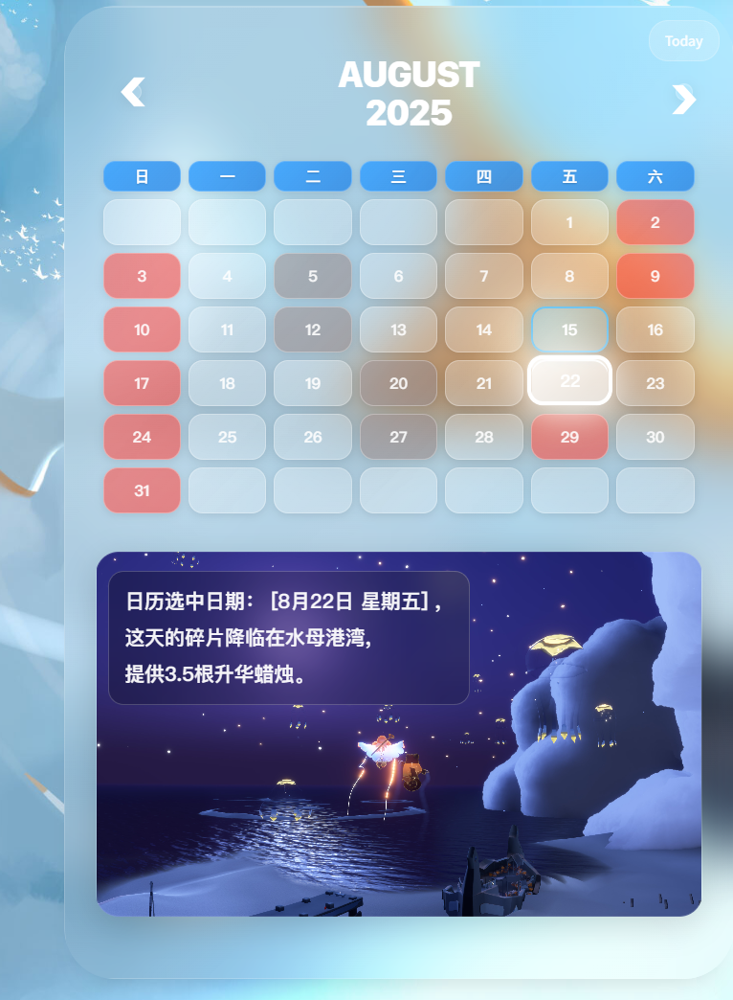

# Sky: Children of the Light - Shard Event Query Tool

这是一个用于查询《光遇》国服碎片事件的工具。它旨在帮助玩家追踪游戏中的碎片事件，以便更好地规划游戏时间。

## 功能特性

*   📅 **碎片事件日历:** 显示未来碎片事件的日期和时间。
*   📍 **地点提示:** 提供碎片事件可能发生的地点信息。
*   📱 **响应式设计:** 兼容不同设备。

## 技术栈

*   **HTML/CSS/JavaScript:** 前端基础技术。
*   **jQuery:** 简化 JavaScript 操作。
*   **Bootstrap:** 响应式布局和组件。

## 项目链接

* **GitHub 仓库:** [ichozero/skyshard-query](https://github.com/ichozero/skyshard-query)
* **在线预览:** [光遇国服碎片时间查询](https://ichozero.github.io/skyshard-query/)

