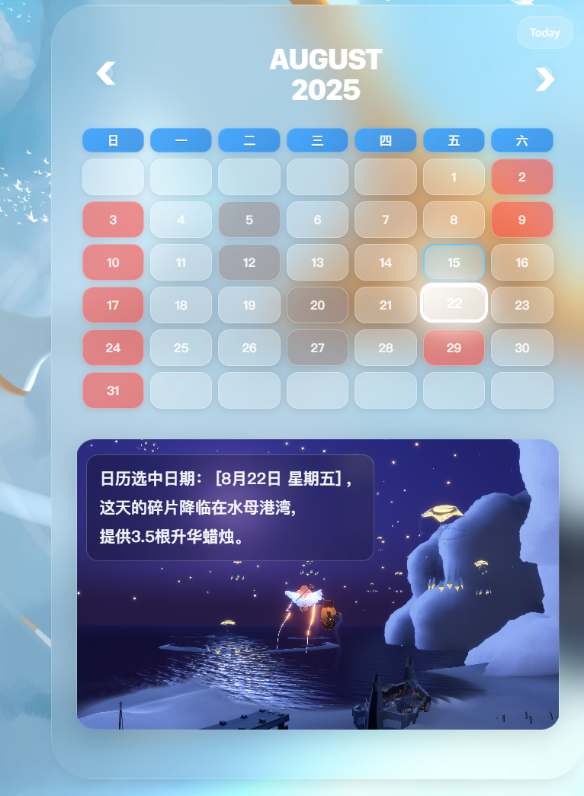

# 🌟 Sky: Children of the Light - Shard Event Query Tool

[](./README_EN.md) [](./README.md)

> A dedicated shard event time query and progress tracking tool designed for Sky: Children of the Light players

This is an elegant web application for querying detailed information about shard events in Sky: Children of the Light. It features a modern frosted glass design style to help players accurately track shard events in the game, plan their gaming time wisely, and ensure they never miss any important shard collection opportunities.



## ✨ Features

### 🗓️ Smart Calendar System
- **Monthly Calendar View**: Clear display of shard event distribution throughout the month
- **Interactive Date Selection**: Click on any date to view detailed shard information for that day
- **Month Navigation**: Quick switching to different months to view future or past events
- **Today Quick Locate**: One-click return to current date
- **Visual Event Indicators**: Different colors to identify different types of shard events

### ⏰ Real-time Progress Tracking
- **Daily Progress Bar**: Real-time display of time progress for the day's shard events
- **Multi-period Display**: Clear distinction between red shard and black shard time periods
- **Selected Date Progress**: View shard time schedules for any selected date
- **Real-time Clock**: Display current time and date, accurate to the second
- **Dynamic Updates**: Progress bar updates automatically every minute, clock updates every second

### 📍 Detailed Location Information
- **Shard Location Tips**: Display specific locations where daily shard events occur
- **Map Area Identification**: Categorized by in-game map areas (Prairie, Forest, Valley, Wasteland, Vault)
- **Candle Type Display**: Show corresponding candle icons and quantity information
- **Background Image Linkage**: Automatically switch to corresponding scene background images based on location

### 🎨 Modern Interface Design
- **Frosted Glass Effect**: Modern frosted glass visual effects implemented with backdrop-filter
- **Apple-style Design**: Borrowing from Apple design language with rounded corners, shadows, and animation effects
- **Gradient Colors**: Carefully crafted gradient color combinations
- **Smooth Animations**: CSS3 animations provide silky smooth interactive experience
- **Hover Effects**: Rich mouse hover and click feedback

### 📱 Cross-platform Compatibility
- **Responsive Design**: Perfect adaptation to mobile phones, tablets, and desktop devices
- **Touch-friendly**: Touch experience optimized for mobile devices
- **High Resolution Support**: Support for Retina displays and 4K monitors
- **Cross-browser Compatibility**: Compatible with mainstream browsers (Chrome, Firefox, Safari, Edge)

### 🔧 Advanced Features
- **Cookie Memory**: Remember user's selected date and automatically restore on next visit
- **Smart Algorithm**: Shard time calculation algorithm based on in-game patterns
- **Performance Optimization**: Lazy loading and image preloading to improve user experience
- **Error Handling**: Comprehensive error handling and user prompt mechanisms

## 🛠️ Technology Stack

### Frontend Core Technologies
- **HTML5**: Semantic tags and modern web standards
- **CSS3**: Flexbox layout, CSS Grid, animations, and frosted glass effects
- **JavaScript ES6+**: Modular programming, Promise, arrow functions, and other modern features
- **jQuery 3.7.1**: Simplified DOM manipulation and event handling

### Development Toolchain
- **Webpack 5**: Module bundling and build tool
- **Webpack Dev Server**: Development environment hot reloading
- **npm**: Dependency management and script execution

### Design & User Experience
- **Apple Human Interface Guidelines**: Following Apple design specifications
- **Frosted Glass Design**: backdrop-filter and semi-transparent effects
- **SF Pro Display Font**: Apple system font and PingFang Chinese font
- **Responsive Layout**: Mobile-first design philosophy

### Browser APIs
- **Date API**: Date and time processing and calculation
- **LocalStorage/Cookie**: User preference settings storage
- **Canvas API**: Graphics drawing and animation effects
- **Web Fonts**: Custom font loading

## 🚀 Quick Start

### Environment Requirements
- Node.js 16.0+ 
- npm 8.0+
- Modern browser (supporting ES6+ and CSS3)

### Install Dependencies
```bash
npm install
```

### Development Mode
```bash
npm run dev
```
Start the development server with hot reloading, accessible at http://localhost:8080 by default

### Production Build
```bash
npm run build
```
Generate optimized production files to the `dist` directory

## 📁 Project Structure

```
skyshard-calendar/
├── src/                    # Source code directory
├── js/                     # JavaScript files
│   ├── main.js            # Main logic and calendar functionality
│   ├── progressBar.js     # Progress bar and time tracking
│   └── location_hint.js   # Location information and candle display
├── css/                   # Style files
├── images/                # Image resources
├── fonts/                 # Font files
├── dist/                  # Build output directory
├── index.html            # Main page
├── package.json          # Project configuration
└── webpack.config.js     # Webpack configuration
```

## 🎯 Core Algorithms

### Shard Time Calculation
The application implements precise time calculation algorithms based on shard patterns in Sky: Children of the Light:

- **Location Rotation Pattern**: Calculate corresponding map areas based on dates
- **Time Period Allocation**: Precise time distribution of red shards and black shards
- **Dynamic Updates**: Real-time calculation of current progress and remaining time

### Performance Optimization
- **Image Lazy Loading**: Reduce initial loading time
- **Debounce Processing**: Avoid frequent duplicate calculations
- **Memory Management**: Timely cleanup of timers and event listeners

## 📊 Browser Compatibility

| Browser | Version Support | Notes |
|---------|----------------|-------|
| Chrome | 88+ | Full support |
| Firefox | 85+ | Full support |
| Safari | 14+ | Full support |
| Edge | 88+ | Full support |
| Mobile Browsers | iOS 14+, Android 8+ | Full support |

## 🔗 Project Links

- **🌟 Live Preview**: [Sky Shard Time Query](https://ichozero.github.io/skyshard_calendar/)
- **📱 GitHub Repository**: [ichozero/skyshard-query](https://github.com/ichozero/skyshard_calendar)
- **📋 Issue Feedback**: [Issues](https://github.com/ichozero/skyshard-query/issues)

## 📸 Feature Screenshots


*Main interface display: Real-time clock, progress bar, and interactive calendar*

## 🤝 Contributing Guide

Welcome to submit Issues and Pull Requests to improve this project!

1. Fork this repository
2. Create a feature branch (`git checkout -b feature/AmazingFeature`)
3. Commit your changes (`git commit -m 'Add some AmazingFeature'`)
4. Push to the branch (`git push origin feature/AmazingFeature`)
5. Create a Pull Request

⭐ If this project is helpful to you, please give it a Star for support!
